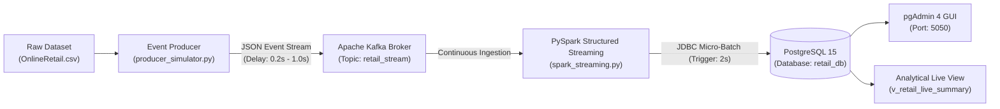

# Panduan Lengkap & Tutorial Modul Ajar: Pure Real-Time Streaming Data Pipeline
> **Mata Kuliah / Pelatihan: Data Engineering & Stream Processing**  
> **Teknologi Utama:** Python 3, Apache Kafka, Apache Spark Structured Streaming, PostgreSQL, pgAdmin 4, & Docker.

---

## 📚 Daftar Isi
1. [Tujuan Pembelajaran (Learning Objectives)](#1-tujuan-pembelajaran-learning-objectives)
2. [Konsep Dasar & Analogi Sederhana (Untuk Siswa)](#2-konsep-dasar--analogi-sederhana-untuk-siswa)
3. [Arsitektur Sistem & Alur Kerja Data](#3-arsitektur-sistem--alur-kerja-data)
4. [Struktur Berkas Proyek](#4-struktur-berkas-proyek)
5. [Panduan Instalasi & Persiapan Lingkungan](#5-panduan-instalasi--persiapan-lingkungan)
6. [Bedah Kode Mendalam (Code, Variable & Syntax Breakdown)](#6-bedah-kode-mendalam-code-variable--syntax-breakdown)
   - [A. Event Producer Simulator (`producer_simulator.py`)](#a-event-producer-simulator-producer_simulatorpy)
   - [B. Spark Structured Streaming Consumer (`spark_streaming.py`)](#b-spark-structured-streaming-consumer-spark_streamingpy)
   - [C. Skema Database & Analitik DDL (`init-db/01-init.sql`)](#c-skema-database--analitik-ddl-init-db01-initsql)
   - [D. Orkestrasi Container (`docker-compose.yml`)](#d-orkestrasi-container-docker-composeyml)
   - [E. Optimasi Dockerfile PySpark (`Dockerfile.spark`)](#e-optimasi-dockerfile-pyspark-dockerfilespark)
   - [F. Pre-Flight Port Conflict Checker (`check_ports.py`)](#f-pre-flight-port-conflict-checker-check_portspy)
7. [Panduan Praktikum Siswa (Hands-on Lab)](#7-panduan-praktikum-siswa-hands-on-lab)
8. [Tantangan & Tugas Eksplorasi Siswa (Student Assignments)](#8-tantangan--tugas-eksplorasi-siswa-student-assignments)
9. [Troubleshooting & FAQ Ramah Pemula](#9-troubleshooting--faq-ramah-pemula)
10. [Rangkuman Perintah Cepat (Cheat Sheet)](#10-rangkuman-perintah-cepat-cheat-sheet)

---

## 1. Tujuan Pembelajaran (Learning Objectives)

Setelah menyelesaikan modul praktikum ini, siswa diharapkan mampu:
1. **Memahami Paradigma Real-Time Streaming:** Menjelaskan perbedaan mendasar antara pemrosesan data berkala (*batch processing*) dengan pemrosesan data seketika (*event-driven stream processing*).
2. **Memahami Peran Message Broker (Apache Kafka):** Menjelaskan konsep *Producer*, *Broker*, *Topic*, dan *Consumer* dalam arsitektur terdistribusi *decoupled*.
3. **Menguasai PySpark Structured Streaming:** Memahami konsep *Unbounded Table*, pendefinisian skema ketat (*schema enforcement*), *streaming transformations*, *micro-batch trigger*, dan persistensi data dengan *checkpointing*.
4. **Mengimplementasikan Data Persistence:** Menyimpan hasil streaming ke Relational Database (PostgreSQL) menggunakan konektor JDBC.
5. **Menggunakan Docker Compose:** Menjalankan multi-container environment yang terisolasi dan saling terhubung dalam satu jaringan virtual (*bridge network*).

---

## 2. Konsep Dasar & Analogi Sederhana (Untuk Siswa)

Bagi pemula, istilah streaming pipeline sering kali terdengar rumit. Mari gunakan **Analogi Restoran Cepat Saji (Fast Food Restaurant)**:

```
[ Pelanggan Datang ]  --->  [ Kasir / Pelayan ]  --->  [ Ban Berjalan Order ]  --->  [ Koki Khusus ]  --->  [ Buku Kasir Toko ]  --->  [ Manajer / Monitor ]
  (OnlineRetail.csv)       (producer_simulator)       (Apache Kafka Topic)      (PySpark Streaming)         (PostgreSQL)                (pgAdmin 4)
```

1. **Pelanggan Melakukan Pesanan (Data Sumber - CSV):**  
   Setiap transaksi di toko adalah catatan pesanan pelanggan: barang apa yang dibeli, berapa banyak, dan harganya.
2. **Kasir Menginput Pesanan (Event Producer):**  
   Kasir mengambil catatan transaksi satu per satu lalu menempelkan stempel waktu transaksi detik itu juga (*timestamp actual*), lalu meletakkannya ke antrean pesanan.
3. **Ban Berjalan Pesanan (Apache Kafka):**  
   Tempat antrean pesanan berjalan. Pesanan tidak langsung dilempar ke dapur, melainkan ditampung di ban berjalan (*message broker*). Jika dapur sedang sibuk, pesanan tidak hilang; pesanan tetap berbaris rapi di ban berjalan.
4. **Koki yang Memeriksa & Memasak Cepat (Apache Spark Streaming):**  
   Koki mengambil pesanan dari ban berjalan setiap 2 detik (*micro-batch*). Koki memeriksa apakah data pesanan ada yang aneh (misal: pesanan dibatalkan/huruf 'C'), menghitung total harga (`Quantity * Price`), lalu merapikan bentuknya.
5. **Buku Kasir Permanen (PostgreSQL):**  
   Setelah pesanan rapi, koki mencatatnya secara permanen ke dalam buku kasir digital (database).
6. **Layar Monitor Manajer (pgAdmin 4):**  
   Manajer toko duduk santai melihat layar monitor komputer untuk melihat omset toko yang terus bertambah secara langsung tanpa perlu kalkulasi manual lagi.

### ❓ Mengapa Tidak Menggunakan Batch Biasa atau Cron Job (Airflow)?
- **Batch Processing:** Seperti mengumpulkan struk belanja seharian dalam sebuah kardus, lalu baru dihitung malam hari jam 23.00. Jika ada pesanan yang mencurigakan (fraud) di pagi hari, kita baru tahu 12 jam kemudian!
- **Real-Time Streaming:** Setiap satu struk belanja keluar, detik itu juga langsung diproses dan dilaporkan. Laporan keuangan selalu *up-to-date* setiap detik.

---

## 3. Arsitektur Sistem & Alur Kerja Data

Diagram di bawah menggambarkan perjalanan data dari file CSV mentah hingga ke visualisasi data:



### Rincian 6 Komponen Layanan Docker:

| Service Container | Base Image / Sumber | Port Container | Port Host | Peran dalam Pipeline |
| :--- | :--- | :--- | :--- | :--- |
| **`zookeeper`** | `confluentinc/cp-zookeeper:7.3.0` | `2181` | `2181` | Pengatur metadata, pemilihan ketua (*leader election*), dan sinkronisasi broker Kafka. |
| **`kafka`** | `confluentinc/cp-kafka:7.3.0` | `29092`, `9092` | `9092` | Antrean pesan terdistribusi (*message broker*). Menyimpan topik `retail_stream`. |
| **`postgres`** | `postgres:15-alpine` | `5432` | `5432` | Basis data relasional target. Menyimpan tabel `retail_transactions`. |
| **`pgadmin`** | `dpage/pgadmin4:latest` | `80` | `5050` | Antarmuka grafis (GUI) berbasis web untuk menjelajahi dan query PostgreSQL. |
| **`spark_consumer`** | Custom (`Dockerfile.spark`) | - | - | Mesin pemrosesan stream PySpark (Extract, Transform, Load ke PostgreSQL). |
| **`producer`** | Custom (`Dockerfile.producer`) | - | - | Generator simulator yang mengalirkan transaksi retail baris demi baris ke Kafka. |

---

## 4. Struktur Berkas Proyek

Berikut adalah susunan folder dan file beserta peruntukannya:

```
ETL_Streaming/
├── docker-compose.yml           # Orkestrator yang menyalakan 6 container secara bersamaan
├── Dockerfile.spark             # Resep pembuatan container PySpark (dilengkapi caching library)
├── Dockerfile.producer          # Resep pembuatan container Event Producer
├── spark_streaming.py           # Program utama PySpark Structured Streaming & transformasi data
├── producer_simulator.py        # Program simulator pengirim data streaming ke Kafka
├── init-db/
│   └── 01-init.sql              # Skrip SQL pembuat tabel & view otomatis saat PostgreSQL start
├── pgadmin/
│   └── servers.json             # Konfigurasi agar pgAdmin langsung terhubung ke database tanpa setup manual
├── data/
│   └── OnlineRetail.csv         # Dataset sumber e-commerce transaksi retail
├── config.ini                   # File konfigurasi parameter default pipeline
├── check_ports.py               # Alat pendeteksi port bentrok di komputer/laptop siswa
├── requirements.txt             # Daftar pustaka Python jika ingin coba mode non-Docker
├── .env.example                 # Template variabel lingkungan untuk kustomisasi port
├── kafka_producer.py            # Script pembungkus (backward compatibility)
└── SparkConsumer.py             # Script pembungkus (backward compatibility)
```

---

## 5. Panduan Instalasi & Persiapan Lingkungan

### Prasyarat Perangkat:
1. **Docker Desktop:** Pastikan sudah terpasang dan dalam status **Running**.
   - Unduh untuk Windows/Mac/Linux: [https://www.docker.com/products/docker-desktop/](https://www.docker.com/products/docker-desktop/)
2. **Python 3.8+ (Opsional tapi disarankan):** Digunakan untuk menjalankan script pengecekan port `check_ports.py`.
3. **RAM Laptop Minimal:** 8 GB (Direkomendasikan alokasi memori Docker minimal 4 GB).

---

### Langkah 1: Kloning / Buka Direktori Proyek
Buka aplikasi **Terminal** (Mac/Linux) atau **PowerShell / Command Prompt** (Windows), lalu arahkan ke folder proyek:
```bash
cd /path/ke/ETL_Streaming
```

---

### Langkah 2: Pengecekan Konflik Port Komputer Siswa (Penting!)
Komputer siswa (terutama mahasiswa IT) sering kali sudah memiliki aplikasi PostgreSQL bawaan yang sedang berjalan di port `5432`. Jika port tersebut bentrok, Docker akan gagal menyala.

Jalankan script validator bawaan:
```bash
python3 check_ports.py
```
*(Di Windows: `python check_ports.py`)*

- **Jika Muncul `[OK] AMAN`:** Anda bisa langsung melanjutkan ke Langkah 3.
- **Jika Muncul `[!] BENTROK` (misal di port 5432):**
  1. Buat file `.env` dengan menyalin file template:
     ```bash
     cp .env.example .env
     ```
     *(Di Windows Command Prompt: `copy .env.example .env`)*
  2. Buka file `.env` dengan text editor (VS Code, Notepad, dll), lalu ubah port yang bentrok ke port alternatif, misalnya:
     ```ini
     POSTGRES_PORT=5433
     PGADMIN_PORT=5051
     ```
  3. Simpan file, lalu jalankan `python3 check_ports.py` kembali hingga semua status berwarna **HIJAU**.

---

### Langkah 3: Menjalankan Seluruh Pipeline dengan Satu Perintah
Eksekusi perintah berikut di terminal:
```bash
docker compose up -d
```

> **Apa yang terjadi di balik layar?**  
> 1. Docker mengunduh image resmi Zookeeper, Kafka, PostgreSQL, dan pgAdmin 4.
> 2. Docker membangun image kustom untuk PySpark dan Producer.
> 3. Database PostgreSQL dijalankan dan langsung mengeksekusi file `01-init.sql` untuk membuat tabel dan view.
> 4. Kafka siap menerima event, PySpark mulai mendengarkan Kafka, dan Producer mulai mengalirkan data!

---

### Langkah 4: Memeriksa Status Layanan
Pastikan keenam container berjalan dengan sukses:
```bash
docker compose ps
```
Pastikan kolom **STATUS** menunjukkan `Up` untuk semua container (dan `Up (healthy)` untuk postgres).

---

## 6. Bedah Kode Mendalam (Code, Variable & Syntax Breakdown)

Bagian ini dirancang khusus untuk bahan ajar guru/dosen kepada siswa. Setiap baris logika yang krusial dijelaskan hingga ke pemilihan variabel dan alasan sintaksisnya.

---

### A. Event Producer Simulator (`producer_simulator.py`)

File ini bertugas membaca data CSV retail dan memancarkannya satu demi satu sebagai event streaming ke Kafka, menyerupai aksi kasir toko yang sedang melayani transaksi secara langsung.

#### 1. Pemilihan Variabel Kunci:
- `bootstrap_servers`: Alamat jaringan broker Kafka (misal `kafka:29092` di dalam Docker atau `localhost:9092` dari luar). Dinamakan *bootstrap* karena client Kafka hanya perlu mengetahui 1 host awal untuk mengenali seluruh anggota cluster Kafka lainnya.
- `topic`: Nama kategori/saluran antrean pesan di Kafka tempat data dikirim, di sini diberi nama `'retail_stream'`.
- `min_delay` & `max_delay`: Variabel bertipe float (default `0.2` dan `1.0` detik) untuk menentukan rentang jeda pengiriman data secara acak. Tujuannya adalah meniru dunia nyata di mana jeda antara transaksi pembeli tidak pernah persis sama.
- `payload`: Dictionary Python yang menyimpan data transaksi yang telah dinormalisasi sebelum diubah menjadi format JSON.
- `current_ts`: Variabel tanggal dan jam saat ini (`datetime.now(timezone.utc).isoformat()`) yang diinjeksikan ke dalam payload untuk mencatat waktu asli saat event dikirimkan (*event emission timestamp*).

#### 2. Penjelasan Logika & Sintaks Kode:

##### a. Pembuatan KafkaProducer dengan Mekanisme Retry yang Tangguh:
```python
producer = KafkaProducer(
    bootstrap_servers=bootstrap_servers.split(","),
    value_serializer=lambda v: json.dumps(v).encode("utf-8"),
    acks="all",
    retries=3,
    request_timeout_ms=15000,
    api_version=(0, 10, 1),
)
```
- **`value_serializer=lambda v: json.dumps(v).encode("utf-8")`:**  
  *Mengapa harus ada ini?* Kafka hanya menerima data mentah berupa deretan bit biner (*raw bytes*). Fungsi lambda ini melakukan dua hal:
  1. `json.dumps(v)` mengubah objek Dictionary Python menjadi string JSON.
  2. `.encode("utf-8")` mengubah teks string menjadi byte biner berstandar UTF-8 agar bisa dikirim melalui jaringan kawat Kafka.
- **`acks="all"`:**  
  Singkatan dari *acknowledgments*. Pengaturan ini memerintahkan Kafka untuk memastikan pesan benar-benar sudah disimpan oleh broker sebelum menyatakan pengiriman berhasil (*guaranteed delivery*).

##### b. Normalisasi Kolom Data (`normalize_record`):
```python
def normalize_record(row: dict) -> dict:
    invoice = row.get("Invoice") or row.get("InvoiceNo") or row.get("invoice") or ""
    quantity = row.get("Quantity") or row.get("quantity") or "0"
    price = row.get("Price") or row.get("UnitPrice") or row.get("price") or "0.0"
    current_ts = datetime.now(timezone.utc).isoformat()
    return { ... }
```
- **Logika `.get(...) or ...`:**  
  Dataset publik sering kali memiliki nama header yang tidak konsisten (kadang ditulis `Invoice`, kadang `InvoiceNo`, kadang huruf kecil `invoice`). Logika fallback ini mencegah program melempar error `KeyError` jika format kolom sedikit bergeser.

##### c. Pengiriman Streaming Berkelanjutan (`stream_data`):
```python
with open(filepath, "r", encoding="utf-8", errors="replace") as csv_file:
    reader = csv.DictReader(csv_file)
    for row_idx, raw_row in enumerate(reader, start=1):
        payload = normalize_record(raw_row)
        future = producer.send(topic, value=payload)
        
        # Simulasi jeda waktu antar pembeli
        delay = random.uniform(min_delay, max_delay)
        time.sleep(delay)
```
- **`csv.DictReader`:** Membaca baris CSV langsung sebagai kamus (*dictionary*), di mana kunci (*key*) diambil dari nama kolom baris pertama CSV.
- **`producer.send(topic, value=payload)`:** Mengirim pesan ke Kafka secara asinkron (*non-blocking*).
- **`random.uniform(min_delay, max_delay)`:** Menghasilkan angka pecahan acak antara 0.2 hingga 1.0 detik.
- **`producer.flush()` dan `producer.close()`:** Diletakkan di dalam blok `finally`. Memastikan sisa data di memori pengiriman (*buffer*) dikosongkan dan dikirim tuntas ke broker sebelum aplikasi ditutup secara bersih.

---

### B. Spark Structured Streaming Consumer (`spark_streaming.py`)

File ini adalah otak pemrosesan data (*the engine*). Menggunakan Apache Spark Structured Streaming untuk mengonsumsi stream dari Kafka, membersihkan data kotor, melakukan perhitungan matematika bisnis, dan menyimpannya ke PostgreSQL.

#### 1. Pemilihan Variabel Kunci:
- `spark`: Objek `SparkSession`, pintu gerbang utama untuk mengakses seluruh fitur komputasi PySpark.
- `retail_schema`: Objek `StructType` yang mendefinisikan "kontrak bentuk data" (nama kolom dan tipe datanya).
- `kafka_stream`: Streaming DataFrame mentah yang dibaca dari Kafka sebelum di-parsing.
- `parsed_stream`: Streaming DataFrame yang string JSON-nya telah diurai menjadi kolom-kolom terstruktur.
- `cleaned_stream`: DataFrame akhir yang telah dibersihkan nilainya dan ditambahkan kolom kalkulasi bisnis.
- `checkpoint_dir`: Lokasi folder untuk menyimpan catatan kemajuan streaming (offset Kafka).

#### 2. Penjelasan Logika & Sintaks Kode:

##### a. Inisialisasi SparkSession dengan Optimasi Memory:
```python
spark = SparkSession.builder \
    .appName(app_name) \
    .master("local[*]") \
    .config("spark.driver.memory", "512m") \
    .config("spark.executor.memory", "512m") \
    .config("spark.jars.packages", packages) \
    .config("spark.sql.shuffle.partitions", "2") \
    .config("spark.sql.ansi.enabled", "false") \
    .getOrCreate()
```
- **`master("local[*]")`:** Memberitahu Spark untuk menggunakan semua inti prosesor (*CPU cores*) yang tersedia di mesin lokal.
- **`spark.sql.shuffle.partitions = 2`:**  
  *Penting untuk edukasi!* Secara default, Apache Spark menggunakan **200 partisi** untuk operasi shuffle. Nilai default 200 itu dibuat untuk cluster server raksasa dengan ribuan core CPU. Jika dijalankan di laptop siswa, Spark akan membuat 200 thread kecil yang membuat laptop menjadi lemot. Menurunkannya ke `2` membuat komputasi menjadi sangat ringan dan cepat.
- **`spark.sql.ansi.enabled = false`:** Mematikan mode ketat ANSI SQL agar ketika ada konversi data yang gagal (misal teks anomali di kolom angka), Spark tidak langsung *crash*, melainkan menghasilkan `NULL`.

##### b. Definisi Skema Data Ketat (`StructType`):
```python
def build_retail_schema() -> StructType:
    return StructType([
        StructField("Invoice", StringType(), True),
        StructField("StockCode", StringType(), True),
        StructField("Description", StringType(), True),
        StructField("Quantity", StringType(), True),
        StructField("InvoiceDate", StringType(), True),
        StructField("Price", StringType(), True),
        StructField("CustomerID", StringType(), True),
        StructField("Country", StringType(), True),
        StructField("current_timestamp", StringType(), True),
    ])
```
- *Kenapa kolom angka `Quantity` dan `Price` didefinisikan sebagai `StringType` di awal?*  
  Ini adalah teknik **Defensive Schema Design**. Jika kita langsung memaksakan `IntegerType` saat membaca JSON dari Kafka, data yang mengandung anomali karakter (seperti spasi kosong, string `"NA"`, atau huruf) akan langsung membuat seluruh record menjadi `NULL` atau rusak. Dengan membacanya sebagai string terlebih dahulu, kita memiliki kontrol penuh untuk membersihkannya di tahap transformasi.

##### c. Mengonsumsi Stream dari Kafka (`spark.readStream`):
```python
kafka_stream = spark.readStream \
    .format("kafka") \
    .option("kafka.bootstrap.servers", config["kafka_bootstrap_servers"]) \
    .option("subscribe", config["kafka_topic"]) \
    .option("startingOffsets", "latest") \
    .option("failOnDataLoss", "false") \
    .load()
```
- **`readStream`:** Menandakan bahwa DataFrame yang dibaca bukan tabel statis, melainkan tabel tak terbatas (*unbounded table*) yang barisnya terus bertambah seiring waktu.
- **`startingOffsets: "latest"`:** Memerintahkan Spark untuk hanya membaca pesan baru yang masuk sejak aplikasi dinyalakan (tidak perlu membaca ulang riwayat pesan lama dari masa lalu).

##### d. Parsing JSON dan Ekstraksi Kolom:
```python
parsed_stream = kafka_stream.select(
    F.from_json(F.col("value").cast("string"), retail_schema).alias("payload"),
    F.col("timestamp").alias("kafka_timestamp")
).select("payload.*", "kafka_timestamp")
```
- Pesan Kafka tersimpan di kolom bawaan bernama `value` berformat biner.
- `F.col("value").cast("string")`: Mengubah biner menjadi string teks JSON.
- `F.from_json(..., retail_schema)`: Mem-parsing string JSON menjadi struktur data tabel sesuai skema `retail_schema`.
- `.select("payload.*")`: Membuka bungkus *struct* sehingga seluruh field di dalamnya menjadi kolom mandiri di DataFrame tingkat atas (*flattening*).

##### e. Pembersihan Data & Transformasi ETL (*The Core Logic*):
```python
cleaned_stream = parsed_stream \
    .filter(F.col("Invoice").isNotNull() & (F.trim(F.col("Invoice")) != "")) \
    .withColumn("invoice", F.trim(F.col("Invoice"))) \
    .withColumn("stock_code", F.trim(F.col("StockCode"))) \
    .withColumn("description",
        F.when(F.col("Description").isNull() | (F.trim(F.col("Description")) == ""), "Description Not Provided")
         .otherwise(F.trim(F.col("Description")))
    ) \
    .withColumn("quantity", F.coalesce(F.expr("try_cast(Quantity AS INT)"), F.lit(0))) \
    .withColumn("price", F.coalesce(F.expr("try_cast(Price AS DOUBLE)"), F.lit(0.0))) \
    .withColumn("customer_id",
        F.when(
            F.col("CustomerID").isNull() |
            (F.trim(F.col("CustomerID")) == "") |
            (F.col("CustomerID") == "nan"),
            "Unknown"
        ).otherwise(F.trim(F.col("CustomerID")))
    ) \
    .withColumn("is_cancelled", F.col("Invoice").rlike("^[cC]")) \
    .withColumn("total_amount", F.round(F.abs(F.col("quantity")) * F.col("price"), 2)) \
    .withColumn("processed_at", F.current_timestamp())
```
Mari kita telusuri fungsi-fungsi PySpark yang digunakan:
1. **`F.trim(...)`:** Menghilangkan spasi kosong di awal dan akhir teks agar data rapi.
2. **`try_cast(Quantity AS INT)`:**  
   *Logika Sakti:* Jika `Quantity` bernilai `"10"`, hasilnya `10`. Jika bernilai teks anomali seperti `"ERROR"`, `try_cast` mengembalikan `NULL` alih-alih melempar exception fatal.
3. **`F.coalesce(..., F.lit(0))`:** Jika nilai hasil `try_cast` adalah `NULL`, ganti secara otomatis menjadi angka `0` (*default fallback value*).
4. **`F.col("Invoice").rlike("^[cC]")`:**  
   Ekspresi Reguler (Regex). Pada data retail, faktur yang dibatalkan atau barang retur diawali dengan huruf **C** (contoh: `C536379`). Sintaks ini otomatis menghasilkan nilai boolean `TRUE` jika diawali huruf C/c, dan `FALSE` jika transaksi normal.
5. **`total_amount = F.round(F.abs(F.col("quantity")) * F.col("price"), 2)`:**  
   Menghitung nilai omset transaksi belanja dalam bentuk desimal 2 angka di belakang koma (`F.round(..., 2)`). Penggunaan `F.abs(...)` (nilai mutlak) memastikan kalkulasi nilai barang tetap positif meskipun kuantitas bertanda minus karena pembatalan.
6. **`processed_at = F.current_timestamp()`:**  
   Mencatat waktu persis kapan Spark selesai memproses baris ini. Kolom ini penting untuk memonitor *latency* (selisih waktu antara event dibuat vs saat data disimpan ke database).

##### f. Menyimpan ke PostgreSQL melalui JDBC (`foreachBatch`):
```python
def create_postgres_writer(...):
    def write_to_postgres(batch_df, batch_id):
        record_count = batch_df.count()
        if record_count == 0:
            return
        
        # Tulis batch ke PostgreSQL
        batch_df.write \
            .format("jdbc") \
            .option("url", postgres_url) \
            .option("dbtable", postgres_table) \
            .option("user", postgres_user) \
            .option("password", postgres_password) \
            .option("driver", postgres_driver) \
            .mode("append") \
            .save()
    return write_to_postgres
```
- **Mengapa `foreachBatch`?**  
  Secara native, Spark Structured Streaming didesain untuk sink seperti file Parquet atau Kafka. Untuk menulis ke Relational Database (seperti PostgreSQL, MySQL, atau Oracle) menggunakan JDBC driver standar, `foreachBatch` membagi stream menjadi micro-batch kecil dan memperlakukannya sebagai DataFrame batch biasa yang aman ditulis dengan perintah `.write.mode("append")`.
- **`mode("append")`:** Menambahkan baris baru ke tabel tanpa menghapus baris data yang sudah ada sebelumnya.

##### g. Memulai Query Streaming & Checkpoint:
```python
streaming_query = cleaned_stream.writeStream \
    .foreachBatch(write_to_postgres) \
    .outputMode("append") \
    .trigger(processingTime="2 seconds") \
    .option("checkpointLocation", config["checkpoint_dir"]) \
    .start()
```
- **`trigger(processingTime="2 seconds")`:** Memberitahu Spark untuk memeriksa dan memproses akumulasi data baru setiap interval 2 detik sekali.
- **`option("checkpointLocation", ...)`:**  
  *Fitur Kritis Fault-Tolerance!* Spark mencatat nomor antrean pesan (*offset*) terakhir yang berhasil disimpan ke PostgreSQL di dalam folder checkpoint. Jika listrik padam atau container di-restart, Spark tidak akan memproses data dari awal lagi, melainkan melanjutkan dari offset persis saat terhenti.

---

### C. Skema Database & Analitik DDL (`init-db/01-init.sql`)

Skrip SQL ini dieksekusi secara otomatis saat database PostgreSQL pertama kali dinyalakan.

```sql
CREATE TABLE IF NOT EXISTS retail_transactions (
    id BIGSERIAL PRIMARY KEY,
    invoice VARCHAR(50),
    stock_code VARCHAR(50),
    description TEXT,
    quantity INTEGER,
    invoice_date TIMESTAMP,
    price DOUBLE PRECISION,
    customer_id VARCHAR(50),
    country VARCHAR(100),
    is_cancelled BOOLEAN DEFAULT FALSE,
    total_amount DOUBLE PRECISION,
    event_timestamp TIMESTAMP,
    processed_at TIMESTAMP DEFAULT CURRENT_TIMESTAMP
);
```

#### Alasan Pemilihan Tipe Data:
- **`id BIGSERIAL PRIMARY KEY`:** Integer 64-bit yang otomatis bertambah nilainya (`1, 2, 3, ...`). Memberikan identitas unik untuk setiap baris data yang masuk.
- **`VARCHAR(50)` vs `TEXT`:** Kolom dengan panjang terkontrol seperti nomor nota (`invoice`) dan kode produk (`stock_code`) menggunakan `VARCHAR(50)`. Kolom keterangan produk menggunakan `TEXT` karena panjang deskripsi barang dapat bervariasi.
- **`DOUBLE PRECISION`:** Tipe data pecahan presisi ganda untuk angka moneter (`price` dan `total_amount`).
- **`BOOLEAN DEFAULT FALSE`:** Flag penanda transaksi batal. Default bernilai `FALSE`.

#### Optimasi Performa dengan Indexing:
```sql
CREATE INDEX IF NOT EXISTS idx_retail_tx_invoice ON retail_transactions(invoice);
CREATE INDEX IF NOT EXISTS idx_retail_tx_country ON retail_transactions(country);
CREATE INDEX IF NOT EXISTS idx_retail_tx_processed ON retail_transactions(processed_at);
```
- *Materi untuk Siswa:* Tanpa Index, saat tabel sudah terisi ratusan ribu baris, database harus membaca seluruh isi harddisk (*Full Table Scan*) untuk mencari data negara tertentu. Pembuatan Index di kolom `country` dan `processed_at` membuat pencarian query analitik secepat kilat (*B-Tree index lookup*).

#### Real-Time Analytical View (`v_retail_live_summary`):
```sql
CREATE OR REPLACE VIEW v_retail_live_summary AS
SELECT 
    country,
    COUNT(*) AS total_transactions,
    SUM(CASE WHEN is_cancelled THEN 1 ELSE 0 END) AS total_cancelled,
    ROUND(COALESCE(SUM(total_amount), 0)::numeric, 2) AS total_revenue,
    ROUND(COALESCE(AVG(total_amount), 0)::numeric, 2) AS avg_order_value,
    MAX(event_timestamp) AS latest_event_time,
    MAX(processed_at) AS last_processed_at
FROM retail_transactions
GROUP BY country
ORDER BY total_revenue DESC;
```
- **View ini membuat dashboard analitik siap pakai.** Tanpa perlu menulis kueri agregasi panjang setiap kali membuka database, pengguna cukup menjalankan `SELECT * FROM v_retail_live_summary` untuk melihat total omset, jumlah barang retur, dan rata-rata belanja per negara secara live.

---

### D. Orkestrasi Container (`docker-compose.yml`)

File ini mendefinisikan infrastruktur terpadu agar semua siswa memiliki lingkungan kerja yang persis sama tanpa masalah *"tapi di laptop saya jalan, pak!"*.

Kutipan penting:
```yaml
networks:
  streaming_network:
    name: streaming_network
    driver: bridge
```
- Seluruh container dihubungkan ke jaringan virtual yang sama (`streaming_network`). Akibatnya, container Spark bisa memanggil Kafka cukup dengan menggunakan nama servicenya: `kafka:29092`, dan memanggil database dengan `postgres:5432` tanpa perlu memikirkan IP dinamis.

```yaml
  postgres:
    image: postgres:15-alpine
    healthcheck:
      test: ["CMD-SHELL", "pg_isready -U postgres -d retail_db"]
      interval: 5s
      timeout: 5s
      retries: 5

  spark_consumer:
    depends_on:
      kafka:
        condition: service_started
      postgres:
        condition: service_healthy
```
- **`healthcheck` & `depends_on: condition: service_healthy`:**  
  *Mengapa ini penting?* Saat database PostgreSQL menyala, container belum tentu siap menerima koneksi (PostgreSQL butuh 2-3 detik untuk inisialisasi internal). Fitur *healthcheck* menguji apakah database sudah siap menerima koneksi via perintah `pg_isready`. Container `spark_consumer` akan menunggu dengan sabar sampai PostgreSQL benar-benar sehat (*healthy*) sebelum mulai berjalan. Hal ini mencegah error fatal koneksi terputus saat awal start.

---

### E. Optimasi Dockerfile PySpark (`Dockerfile.spark`)

Salah satu tantangan terbesar saat mengajar di kelas adalah **koneksi internet sekolah/kampus yang lambat atau dibatasi firewall**.

Perhatikan trik cerdas pada [`Dockerfile.spark`](file:///Users/iqdamshidqiali/Documents/ETL_Streaming/Dockerfile.spark) baris 15–20:
```dockerfile
# Pre-fetch Spark Kafka connector & PostgreSQL JDBC driver during image build
RUN python3 -c "\
from pyspark.sql import SparkSession; \
spark = SparkSession.builder.master('local[1]') \
    .config('spark.jars.packages', 'org.apache.spark:spark-sql-kafka-0-10_2.12:3.5.3,org.postgresql:postgresql:42.6.0') \
    .getOrCreate(); \
spark.stop()"
```
- **Mengapa ini krusial untuk pembelajaran?**  
  Secara default, saat Spark dijalankan, Spark akan mencoba mengunduh file pustaka JAR (seperti konektor Kafka dan PostgreSQL JDBC) dari Maven Central di internet. Jika internet di kelas terputus, Spark akan gagal menyala.
- Dengan menjalankan potongan kode Python di atas saat **proses pembuatan image Docker (*build-time*)**, semua file JAR berukuran besar sudah tersimpan permanen di dalam cache container. Saat siswa menjalankan `docker compose up -d`, sistem dapat berjalan **100% OFFLINE** tanpa perlu koneksi internet sama sekali!

---

### F. Pre-Flight Port Conflict Checker (`check_ports.py`)

Skrip pembantu menggunakan modul bawaan Python `socket`:
```python
def is_port_in_use(port: int, host: str = "127.0.0.1") -> bool:
    with socket.socket(socket.AF_INET, socket.SOCK_STREAM) as s:
        s.settimeout(0.5)
        result = s.connect_ex((host, port))
        return result == 0
```
- `s.connect_ex((host, port))`: Mencoba melakukan jabat tangan koneksi TCP (*TCP handshake*) ke port tertentu.
- Jika mengembalikan angka `0`, artinya port tersebut sedang terbuka dan ada aplikasi lain yang mendengarkan (berarti port **sedang terpakai/bentrok**).
- Skrip ini memberikan peringatan dini yang ramah kepada siswa sebelum mereka panik melihat pesan error Docker yang panjang.

---

## 7. Panduan Praktikum Siswa (Hands-on Lab)

Setelah pipeline berjalan, ajak siswa untuk melakukan eksplorasi data secara visual melalui antarmuka web pgAdmin 4.

### Langkah 1: Membuka pgAdmin 4 di Browser
1. Buka browser web (Chrome, Firefox, Edge, Safari), lalu ketikkan alamat:  
   👉 **[http://localhost:5050](http://localhost:5050)**  
   *(Catatan: Jika Anda mengubah port di `.env` menjadi 5051, akses `http://localhost:5051`)*
2. Masukkan akun administrator:
   - **Email:** `admin@admin.com`
   - **Password:** `admin`
3. Klik tombol **Login**.

---

### Langkah 2: Mengakses Database Toko
1. Pada menu pohon (*Object Explorer*) di sebelah kiri, klik tanda panah pada **Servers**.
2. Klik server bernama: **PostgreSQL Retail DB**.
   - Masukkan kata sandi database: `postgrespassword`
   - Centang opsi **Save Password** agar tidak perlu mengetikkan ulang.
3. Telusuri hierarki menu:  
   `Databases` ➔ `retail_db` ➔ `Schemas` ➔ `public` ➔ `Tables`.
4. Anda akan melihat tabel `retail_transactions`.
5. Klik menu **Tools** di bar atas ➔ klik **Query Tool** (ikon bergambar terminal).

---

### Langkah 3: Menjalankan Kueri Analitik Real-Time

Ajak siswa mencoba kueri-kueri interaktif berikut:

#### 🧪 Kueri 1: Melihat Transaksi yang Baru Saja Mengalir Masuk
```sql
SELECT 
    id, 
    invoice, 
    stock_code, 
    description, 
    quantity, 
    price, 
    total_amount, 
    country, 
    is_cancelled, 
    processed_at
FROM retail_transactions
ORDER BY id DESC
LIMIT 20;
```
> **Instruksi untuk Siswa:**  
> Klik tombol **Execute** (ikon tombol Play segitiga atau tekan **F5** di keyboard).  
> Tunggu 3 detik, lalu tekan **F5** lagi.  
> Perhatikan bagaimana nomor `id` dan transaksi baru terus bermunculan secara seketika!

---

#### 🧪 Kueri 2: Memantau Dashboard Omset Penjualan per Negara
```sql
SELECT * FROM v_retail_live_summary;
```
> **Pertanyaan Diskusi:**  
> Negara mana yang menduduki peringkat teratas dalam total omset (*total_revenue*)?  
> Berapa banyak transaksi yang dibatalkan (*total_cancelled*)?

---

#### 🧪 Kueri 3: Mengukur Latensi Pemrosesan Sistem (End-to-End Latency)
Kueri ini menghitung selisih waktu antara event dibuat di kasir vs saat tersimpan di database:
```sql
SELECT 
    COUNT(*) AS total_transaksi_tersimpan,
    ROUND(SUM(total_amount)::numeric, 2) AS total_omset_kotor,
    ROUND(AVG(EXTRACT(EPOCH FROM (processed_at - event_timestamp)))::numeric, 3) AS rata_rata_latensi_detik
FROM retail_transactions;
```
> Rata-rata latensi biasanya berkisar antara **0.5 s/d 2.0 detik**, membuktikan performa *near real-time* yang sangat cepat!

---

#### 🧪 Kueri 4: Mencari 10 Barang Terlaris (Top 10 Best Sellers)
```sql
SELECT 
    stock_code,
    description,
    SUM(quantity) AS total_terjual,
    ROUND(SUM(total_amount)::numeric, 2) AS total_nilai_penjualan
FROM retail_transactions
WHERE is_cancelled = FALSE
GROUP BY stock_code, description
ORDER BY total_terjual DESC
LIMIT 10;
```

---

## 8. Tantangan & Tugas Eksplorasi Siswa (Student Assignments)

Untuk menguji pemahaman konsep dan kode, berikan tugas-tugas berikut kepada siswa:

### 🎯 Tantangan 1: Mengatur Kecepatan Simulator Kasir
**Tugas:** Ubah jeda pengiriman data pada `producer_simulator.py` agar transaksi mengalir jauh lebih cepat (misal antara 0.05 s/d 0.1 detik).  
**Petunjuk:** Buka file `producer_simulator.py`, cari parameter `min_delay` dan `max_delay` pada fungsi `stream_data`.

### 🎯 Tantangan 2: Menambahkan Kolom Kategori Pembelian (PySpark Transformation)
**Tugas:** Pada file `spark_streaming.py`, tambahkan sebuah kolom baru bernama `spending_category` dengan aturan bisnis berikut:
- Jika `total_amount >= 50.0`, beri label `'HIGH'`
- Jika `total_amount` antara `15.0` dan `< 50.0`, beri label `'MEDIUM'`
- Jika `total_amount < 15.0`, beri label `'LOW'`

**Petunjuk Kode PySpark:**
Gunakan fungsi `F.when().when().otherwise()`:
```python
.withColumn("spending_category",
    F.when(F.col("total_amount") >= 50.0, "HIGH")
     .when(F.col("total_amount") >= 15.0, "MEDIUM")
     .otherwise("LOW")
)
```
*Ingat untuk menambahkan juga kolom `spending_category VARCHAR(20)` pada tabel di `init-db/01-init.sql`.*

### 🎯 Tantangan 3: Kueri Analisis Deteksi Retur
**Tugas:** Tuliskan kueri SQL di pgAdmin untuk mencari pelanggan (`customer_id`) mana yang paling sering melakukan pembatalan pesanan (`is_cancelled = TRUE`).

---

## 9. Troubleshooting & FAQ Ramah Pemula

### ⚠️ Masalah 1: "Saat menjalankan `SELECT COUNT(*)`, kenapa hanya muncul 1 angka?"
**Penjelasan:**  
Fungsi `COUNT(*)` adalah fungsi agregasi matematika untuk menghitung jumlah total baris. Jadi wajar jika hasilnya hanya 1 baris angka (misal: `1450`).  
**Solusi:**  
Jika ingin melihat rincian isi transaksinya baris demi baris, gunakan:
```sql
SELECT * FROM retail_transactions ORDER BY id DESC LIMIT 50;
```

---

### ⚠️ Masalah 2: Error `Bind for 0.0.0.0:5432 failed: port is already allocated`
**Penyebab:**  
Port `5432` di komputer siswa sudah dipakai oleh service PostgreSQL lokal bawaan Windows/Mac yang aktif di background.  
**Solusi Cepat:**  
1. Salin file template `.env.example` menjadi `.env`.
2. Ubah baris `POSTGRES_PORT=5432` menjadi `POSTGRES_PORT=5433`.
3. Jalankan `docker compose up -d` kembali.

---

### ⚠️ Masalah 3: Ingin Mereset Database Menjadi Kosong Kembali (0 Record)
**Solusi:**  
Gunakan flag `-v` (*volumes*) untuk membuang seluruh penyimpanan lama:
```bash
docker compose down -v
docker compose up -d
```
Docker akan membuat ulang database bersih dari nol dan mengeksekusi ulang `01-init.sql`.

---

### ⚠️ Masalah 4: Bagaimana Cara Melihat Log Secara Live di Terminal?
Untuk melihat apa yang sedang dikerjakan oleh masing-masing container:
```bash
# Memantau pengiriman data kasir (Producer)
docker logs -f producer

# Memantau pemrosesan data PySpark
docker logs -f spark_consumer
```
*(Tekan `Ctrl + C` untuk keluar dari tampilan log).*

---

## 10. Rangkuman Perintah Cepat (Cheat Sheet)

| Perintah | Deskripsi Fungsi |
| :--- | :--- |
| `python3 check_ports.py` | Mengecek apakah ada port yang bentrok sebelum menyalakan Docker. |
| `docker compose up -d` | Menyalakan seluruh sistem pipeline di latar belakang (*detached mode*). |
| `docker compose ps` | Memeriksa status kesehatan seluruh container. |
| `docker logs -f producer` | Melihat jalannya pengiriman data event secara live. |
| `docker logs -f spark_consumer` | Melihat proses pembagian micro-batch PySpark ke database. |
| `docker compose down` | Menghentikan seluruh container dengan aman tanpa menghapus data. |
| `docker compose down -v` | Menghentikan container sekaligus **mereset total data database**. |
| `docker compose build --no-cache` | Mengkompilasi ulang image container jika ada perubahan skrip Python. |

---
*Selamat Belajar dan Bereksplorasi dengan Dunia Real-Time Big Data Engineering! 🚀*
